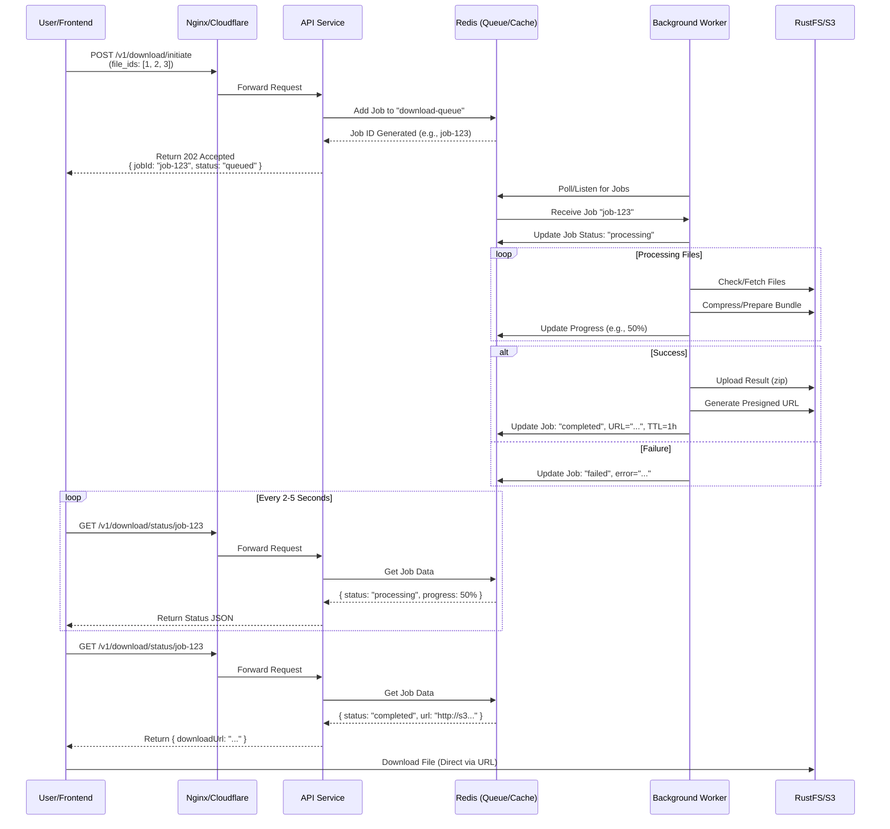

# Architecture Design: Asynchronous Download System

## 1. Architecture Diagram



## 2. Technical Approach

**Chosen Pattern: Option A: Polling Pattern + Asynchronous Queue**

### Justification
We chose the Polling Pattern backed by a persistent queue (Redis/BullMQ) because it robustly addresses the specific constraints of this challenge:

1.  **Eliminates Connection Timeouts**: The initial HTTP request (`initiate`) returns immediately (sub-100ms). The long-running work happens in the background, decoupled from the HTTP connection. This bypasses Cloudflare's 100s timeout and the browser's timeouts entirely.
2.  **Resource Efficiency**: The API server doesn't hold open threads/connections waiting for S3. It simply dispatches a job and handles quick status checks. This drastically reduces memory usage compared to keeping thousands of connections open.
3.  **Resilience**: If the user closes the browser, the job continues processing. When they return (or if the frontend reconnects), the job status is still available in Redis.
4.  **Scalability**: We can scale the "Worker" services independently of the API services. If downloads pile up, we just add more workers.
5.  **Simplicity**: Unlike WebSockets, polling doesn't require sticky sessions, specialized load balancer configuration, or handling complex disconnection/reconnection logic. It works reliably over standard HTTP.

## 3. Implementation Details

### API Contract Changes

#### Existing Endpoints
*   `POST /v1/download/start`: **Deprecated** for large files. Used only for immediate/small downloads or testing.

#### New Endpoints

**1. Initiate Download**
*   **Endpoint**: `POST /v1/download/initiate` (Modified to be async)
*   **Response (202 Accepted)**:
    ```json
    {
      "jobId": "550e8400-e29b-41d4-a716-446655440000",
      "status": "queued",
      "pollingData": {
        "endpoint": "/v1/download/status/550e8400-e29b-41d4-a716-446655440000",
        "intervalMs": 3000
      }
    }
    ```

**2. Check Status**
*   **Endpoint**: `GET /v1/download/status/:jobId`
*   **Response (200 OK)**:
    ```json
    {
      "jobId": "550e8400-e29b-41d4-a716-446655440000",
      "status": "processing", // queued, processing, completed, failed
      "progress": 45,          // Percentage (0-100)
      "result": null           // Populated when status is 'completed'
    }
    ```
*   **Response (Completed)**:
    ```json
    {
      "jobId": "...",
      "status": "completed",
      "progress": 100,
      "result": {
        "downloadUrl": "https://rustfs.example.com/downloads/bundle-123.zip?token=...",
        "expiresAt": "2025-12-12T10:00:00Z"
      }
    }
    ```

### Database/Cache Schema (Redis)

We will use **Redis** for both the Job Queue and the Job Status store to ensure speed and TTL management.

**Key Structure:** `job:{jobId}`
**Type:** Hash
**TTL:** 1 hour (auto-expire old jobs)

| Field | Type | Description |
| :--- | :--- | :--- |
| `status` | String | `queued` \| `processing` \| `completed` \| `failed` |
| `progress` | Number | 0-100 integer |
| `error` | String | Error message if failed |
| `url` | String | Presigned S3 URL (only if completed) |
| `created_at` | Timestamp | Job creation time |

### Background Job Strategy

*   **Queue System**: **BullMQ** (Node.js wrapper for Redis streams). It provides robust handling/retries out of the box.
*   **Worker Process**: A separate Node.js process (or same container, different entrypoint) that:
    1.  Consumes jobs from `download-queue`.
    2.  Simulates delay (or performs actual zipper logic).
    3.  Updates Redis hash periodically.
    4.  Uploads result to S3.

### Error Handling & Retries

*   **Retries**: Configure BullMQ to retry failed jobs **3 times** with an exponential backoff (e.g., 1s, 5s, 15s).
*   **Dead Letter Queue (DLQ)**: If a job fails after 3 attempts, move it to `failed-jobs` queue for manual inspection.
*   **User Feedback**: If status becomes `failed`, the API returns a generic "Download failed, please try again" message to the client, while logging the specific stack trace internally.

### Timeout Configuration

*   **API Gateway (Nginx)**: 30s read timeout (standard). Since our API responds in <100ms, this is safe.
*   **Worker Processing**: Set a "Job Stalled" timeout of 5 minutes. If a worker crashes mid-job, BullMQ detects the stall and re-queues the job for another worker.

## 4. Proxy Configuration

Since we are using **Polling**, the proxy configuration handles standard short-lived requests. No special "long timeout" is needed, which is the main benefit of this approach.

### Nginx (Reverse Proxy)
```nginx
server {
    listen 80;
    
    location / {
        proxy_pass http://delineate-app:3000;
        
        # Standard timeouts are sufficient
        proxy_connect_timeout 60s;
        proxy_send_timeout 60s;
        proxy_read_timeout 60s;
        
        # Ensure we pass Host for presigned URLs if needed
        proxy_set_header Host $host;
    }
}
```

### Cloudflare
*   **Cache Rules**: Bypass cache for `/v1/download/status/*` to ensure real-time status updates is returned.
*   **Timeouts**: Default 100s timeout is perfectly fine, as no request lasts longer than ~1 second.

## 5. Frontend Integration (React)

### Logic Flow

1.  **Initiate**: User clicks "Download". App calls `POST /initiate`.
2.  **Store ID**: App saves `jobId` from response in state.
3.  **Poll**: Use a hook (custom or `useQuery` with `refetchInterval`).
    *   Call `GET /status/:jobId` every 2 seconds.
    *   Update UI Progress Bar based on `response.progress`.
4.  **Complete**:
    *   If `status === 'completed'`: Stop polling. Trigger `window.location.href = response.result.downloadUrl`.
    *   If `status === 'failed'`: Stop polling. Show Error Toast.

### Example Code (React)

```typescript
const useDownload = () => {
  const [jobId, setJobId] = useState(null);
  const [status, setStatus] = useState('idle');
  const [progress, setProgress] = useState(0);

  // Polling Effect
  useEffect(() => {
    if (!jobId || status === 'completed' || status === 'failed') return;

    const interval = setInterval(async () => {
      const res = await fetch(`/v1/download/status/${jobId}`);
      const data = await res.json();
      
      setStatus(data.status);
      setProgress(data.progress);

      if (data.status === 'completed') {
        window.location.href = data.result.downloadUrl; // Trigger download
      }
    }, 2000); // Poll every 2s

    return () => clearInterval(interval);
  }, [jobId, status]);

  const startDownload = async (fileIds) => {
    const res = await fetch('/v1/download/initiate', {
      method: 'POST',
      body: JSON.stringify({ file_ids: fileIds })
    });
    const data = await res.json();
    setJobId(data.jobId);
    setStatus('queued');
  };

  return { startDownload, status, progress };
};
```
